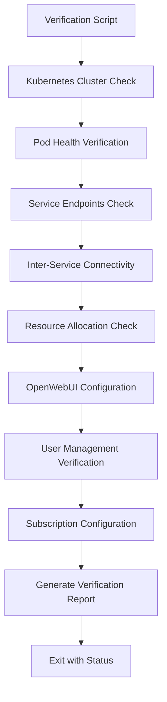
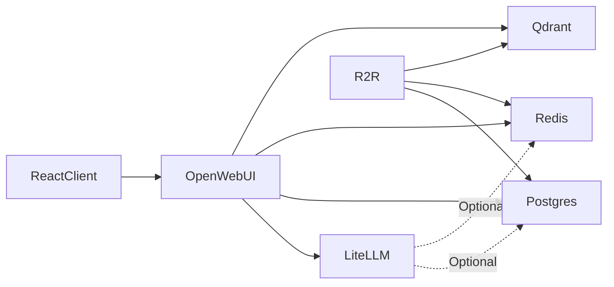

# Site Service Verification and OpenWebUI Configuration Plan

## Executive Summary

This document outlines the comprehensive plan for creating a site service verification system for the LLM Stack deployment. The verification system will check that all services are deployed correctly, validate inter-service connectivity, verify OpenWebUI configuration including user management, and provide the ability to disable subscription features.

## Table of Contents

1. [Architecture Overview](#architecture-overview)
2. [Deployment Verification Strategy](#deployment-verification-strategy)
3. [Service-Specific Verification Checklists](#service-specific-verification-checklists)
4. [OpenWebUI User Management](#openwebui-user-management)
5. [Subscription Disabling Strategy](#subscription-disabling-strategy)
6. [Implementation Approach](#implementation-approach)
7. [File Structure](#file-structure)
8. [Output Format](#output-format)
9. [Error Handling](#error-handling)
10. [Implementation Roadmap](#implementation-roadmap)

---

## Architecture Overview

### System Design

The verification system will be implemented as a multi-layered validation framework:



### Verification Layers

1. **Infrastructure Layer**: Kubernetes cluster, namespaces, and resources
2. **Service Layer**: Pod status, service endpoints, and health checks
3. **Connectivity Layer**: Inter-service communication validation
4. **Application Layer**: OpenWebUI-specific configuration and features
5. **User Layer**: User accounts, permissions, and authentication

### Tool Selection

The verification system will use:
- **kubectl**: Primary tool for Kubernetes resource inspection
- **curl**: HTTP endpoint verification and API testing
- **jq**: JSON parsing and data extraction
- **psql**: Direct database queries for user management
- **Bash script**: Orchestration and reporting

---

## Deployment Verification Strategy

### 1. Kubernetes Cluster Verification

**Objective**: Verify the Kubernetes cluster is accessible and healthy

**Checks**:
- Cluster connectivity (`kubectl cluster-info`)
- Namespace existence (`kubectl get namespace llm-stack`)
- Node status and resources (`kubectl get nodes`)
- Cluster version compatibility

**Success Criteria**:
- Cluster is accessible
- `llm-stack` namespace exists
- All nodes are in Ready state
- Cluster version matches expected version

---

### 2. Pod and Deployment Status

**Objective**: Verify all pods are running and healthy

**Services to Check**:
1. PostgreSQL (StatefulSet)
2. Redis (StatefulSet)
3. Qdrant (Deployment)
4. LiteLLM (Deployment)
5. R2R (Deployment)
6. OpenWebUI (Deployment)
7. React Client (Deployment)

**Checks for Each Service**:
- Pod exists (`kubectl get pods -l app=<service>`)
- Pod is Running (`kubectl get pods -o jsonpath='{.status.phase}'`)
- All containers in pod are Ready
- No recent restarts (check restart count)
- Resource allocation matches requests/limits

**Success Criteria**:
- All pods are in Running state
- All containers show Ready status (1/1, 2/2, etc.)
- Restart count is 0 or minimal (<3)
- Age indicates stable deployment

---

### 3. Service Endpoint Accessibility

**Objective**: Verify Kubernetes services are properly exposed

**Checks**:
- Service exists (`kubectl get service <service-name>`)
- ClusterIP is assigned
- Ports are correctly mapped
- Endpoints are populated (`kubectl get endpoints <service-name>`)

**Services**:
| Service | Port | Type | Endpoint Path |
|---------|------|------|---------------|
| postgres-service | 5432 | ClusterIP | N/A (TCP) |
| redis-service | 6379 | ClusterIP | N/A (TCP) |
| qdrant-service | 6333 | ClusterIP | `/` |
| litellm-service | 4000 | ClusterIP | `/health/liveliness` |
| r2r-service | 7272 | ClusterIP | `/v3/health` |
| openwebui-service | 8080 | ClusterIP | `/` |
| react-client-service | 3000 | ClusterIP | `/` |

**Success Criteria**:
- All services have ClusterIP assigned
- Endpoints show at least one ready address
- Port mappings match deployment specifications

---

### 4. Inter-Service Connectivity Validation

**Objective**: Verify services can communicate with their dependencies

#### Connectivity Matrix



#### Test Approach

**Method 1: Use kubectl exec with test containers**
```bash
# Test from OpenWebUI to LiteLLM
kubectl exec -it deployment/openwebui -- curl -f http://dev-litellm:4000/health/liveliness

# Test from R2R to Qdrant
kubectl exec -it deployment/r2r -- curl -f http://dev-qdrant:6333/
```

**Method 2: Use dedicated test pod**
```bash
# Deploy test pod with network tools
kubectl run test-pod --image=curlimages/curl:latest --rm -it -- /bin/sh

# Run connectivity tests from test pod
curl http://dev-litellm:4000/health/liveliness
curl http://dev-qdrant:6333/
curl http://dev-postgres:5432
```

#### Critical Connections to Verify

1. **OpenWebUI Dependencies**:
   - LiteLLM API endpoint reachable
   - Postgres database connection established
   - Redis cache connection established
   - Qdrant vector DB connection established

2. **R2R Dependencies**:
   - Postgres database connection established
   - Qdrant vector DB connection established
   - Redis cache connection established

3. **LiteLLM** (optional dependencies):
   - Postgres database connection (if configured)
   - Redis cache connection (if configured)

**Success Criteria**:
- All HTTP endpoints return successful status codes (200, 204)
- TCP connections to databases succeed
- No connection timeout errors
- DNS resolution works for all internal service names

---

### 5. Health Check Verification

**Objective**: Verify service-specific health endpoints

**Health Endpoints**:
| Service | Health Path | Expected Response |
|---------|-------------|-------------------|
| LiteLLM | `/health/liveliness` | HTTP 200, JSON with status |
| R2R | `/v3/health` | HTTP 200, JSON with status |
| OpenWebUI | `/` | HTTP 200, HTML content |
| Qdrant | `/` or `/health` | HTTP 200 |
| React Client | `/` | HTTP 200, HTML content |

**Verification Method**:
```bash
# Port-forward to service
kubectl port-forward service/dev-litellm 4000:4000 &

# Test health endpoint
curl -f http://localhost:4000/health/liveliness

# Or use kubectl exec
kubectl exec deployment/litellm -- curl -f http://localhost:4000/health/liveliness
```

**Success Criteria**:
- All health endpoints return HTTP 200
- Response format matches expected schema
- Response time is reasonable (<5 seconds)

---

### 6. Resource Allocation Check

**Objective**: Verify resources are properly allocated and not constrained

**Checks**:
- CPU requests vs actual usage (`kubectl top pods`)
- Memory requests vs actual usage
- CPU limits not being throttled
- Memory limits not causing OOMKills
- Storage usage for StatefulSets

**Commands**:
```bash
# Check resource usage
kubectl top pods -n llm-stack

# Check resource limits
kubectl describe pod <pod-name> -n llm-stack | grep -A 5 "Limits:"

# Check for OOMKills
kubectl get pods -n llm-stack -o jsonpath='{range .items[*]}{.metadata.name}{"\t"}{.status.containerStatuses[*].lastState.terminated.reason}{"\n"}{end}'
```

**Expected Resource Ranges**:
| Service | CPU Request | Memory Request | CPU Limit | Memory Limit |
|---------|-------------|----------------|-----------|--------------|
| React Client | 100m | 256Mi | 500m | 512Mi |
| Redis | 100m | 256Mi | 500m | 512Mi |
| Qdrant | 250m | 512Mi | 500m | 1Gi |
| LiteLLM | 250m | 512Mi | 500m | 1Gi |
| R2R | 500m | 1Gi | 1000m | 2Gi |
| OpenWebUI | 250m | 1Gi | 500m | 2Gi |

**Success Criteria**:
- No pods are in OOMKilled state
- CPU usage is within limits
- Memory usage is within limits
- Storage is not full

---

## Service-Specific Verification Checklists

### PostgreSQL (postgres-pgvector)

**Deployment Type**: StatefulSet

**Checks**:
- [ ] StatefulSet exists and has 1 ready replica
- [ ] Pod is in Running state
- [ ] Service endpoint is accessible on port 5432
- [ ] Can connect to database using credentials
- [ ] pgvector extension is installed
- [ ] Required databases exist (r2r_db)
- [ ] Database is accepting connections
- [ ] Storage volume is mounted correctly

**Verification Commands**:
```bash
kubectl get statefulset dev-postgres -n llm-stack
kubectl exec -it dev-postgres-0 -n llm-stack -- psql -U postgres -c "SELECT version();"
kubectl exec -it dev-postgres-0 -n llm-stack -- psql -U postgres -c "\dx" # List extensions
```

**Environment Variables to Verify**:
- `POSTGRES_USER`
- `POSTGRES_PASSWORD`
- `POSTGRES_DB`

---

### Redis

**Deployment Type**: StatefulSet

**Checks**:
- [ ] StatefulSet exists and has 1 ready replica
- [ ] Pod is in Running state
- [ ] Service endpoint is accessible on port 6379
- [ ] Can connect to Redis
- [ ] Redis is responding to PING command
- [ ] RDB persistence is configured
- [ ] Storage volume is mounted correctly

**Verification Commands**:
```bash
kubectl get statefulset redis -n llm-stack
kubectl exec -it redis-0 -n llm-stack -- redis-cli ping
kubectl exec -it redis-0 -n llm-stack -- redis-cli info persistence
```

---

### Qdrant

**Deployment Type**: Deployment

**Checks**:
- [ ] Deployment exists and has 1 ready replica
- [ ] Pod is in Running state
- [ ] HTTP port 6333 is accessible
- [ ] gRPC port 6334 is accessible (optional)
- [ ] Root endpoint returns 200 OK
- [ ] Collections API is accessible
- [ ] Can create test collection
- [ ] Can query collections

**Verification Commands**:
```bash
kubectl get deployment dev-qdrant -n llm-stack
kubectl exec deployment/dev-qdrant -n llm-stack -- curl -f http://localhost:6333/
kubectl exec deployment/dev-qdrant -n llm-stack -- curl -f http://localhost:6333/collections
```

**Environment Variables to Verify**:
- `QDRANT__SERVICE__HTTP_PORT`
- `QDRANT__SERVICE__GRPC_PORT`

---

### LiteLLM

**Deployment Type**: Deployment

**Checks**:
- [ ] Deployment exists and has 1 ready replica
- [ ] Pod is in Running state
- [ ] Port 4000 is accessible
- [ ] Health endpoint returns healthy status
- [ ] Master key authentication works
- [ ] Model endpoint is accessible
- [ ] Can list available models
- [ ] External LLM provider API keys are configured (if applicable)

**Verification Commands**:
```bash
kubectl get deployment litellm -n llm-stack
kubectl exec deployment/litellm -n llm-stack -- curl -f http://localhost:4000/health/liveliness
kubectl exec deployment/litellm -n llm-stack -- curl -H "Authorization: Bearer $LITELLM_MASTER_KEY" http://localhost:4000/models
```

**Environment Variables to Verify**:
- `LITELLM_PORT`
- `LITELLM_HOST`
- `LITELLM_MASTER_KEY`
- `OPENAI_API_KEY` (optional)
- `ANTHROPIC_API_KEY` (optional)

---

### R2R

**Deployment Type**: Deployment

**Checks**:
- [ ] Deployment exists and has 1 ready replica
- [ ] Pod is in Running state
- [ ] Port 7272 is accessible
- [ ] Health endpoint (`/v3/health`) returns healthy status
- [ ] Can connect to PostgreSQL
- [ ] Can connect to Qdrant
- [ ] Can connect to Redis
- [ ] RAG pipeline is functional
- [ ] Document ingestion works

**Verification Commands**:
```bash
kubectl get deployment r2r -n llm-stack
kubectl exec deployment/r2r -n llm-stack -- curl -f http://localhost:7272/v3/health
```

**Environment Variables to Verify**:
- `R2R_PORT`
- `R2R_HOST`
- `R2R_POSTGRES_HOST`
- `R2R_POSTGRES_PORT`
- `R2R_POSTGRES_USER`
- `R2R_POSTGRES_PASSWORD`
- `R2R_POSTGRES_DBNAME`
- `R2R_QDRANT_HOST`
- `R2R_QDRANT_PORT`
- `REDIS_URL`

---

### OpenWebUI

**Deployment Type**: Deployment

**Checks**:
- [ ] Deployment exists and has 1 ready replica
- [ ] Pod is in Running state
- [ ] Port 8080 is accessible
- [ ] Root endpoint returns 200 OK
- [ ] Can connect to LiteLLM backend
- [ ] Can connect to PostgreSQL
- [ ] Can connect to Redis
- [ ] Can connect to Qdrant
- [ ] Web interface loads correctly
- [ ] Authentication is configured as expected
- [ ] User management is functional
- [ ] Subscription features configuration verified

**Verification Commands**:
```bash
kubectl get deployment openwebui -n llm-stack
kubectl exec deployment/openwebui -n llm-stack -- curl -f http://localhost:8080/
kubectl logs deployment/openwebui -n llm-stack | grep -i error
```

**Environment Variables to Verify**:
- `PORT`
- `OPENAI_API_BASE_URL`
- `OPENAI_API_KEY`
- `WEBUI_AUTH`
- `ENABLE_SIGNUP`
- `DEFAULT_USER_ROLE`
- `WEBUI_SECRET_KEY`
- `DATABASE_URL`
- `REDIS_URL`
- `VECTOR_DB`
- `QDRANT_URI`

---

### React Client

**Deployment Type**: Deployment

**Checks**:
- [ ] Deployment exists and has 1 ready replica
- [ ] Pod is in Running state
- [ ] Port 3000 is accessible
- [ ] Root endpoint returns 200 OK
- [ ] Static assets are served correctly
- [ ] Can reach OpenWebUI backend
- [ ] Environment variables are properly injected

**Verification Commands**:
```bash
kubectl get deployment react-client -n llm-stack
kubectl exec deployment/react-client -n llm-stack -- curl -f http://localhost:3000/
```

**Environment Variables to Verify**:
- `VITE_API_BASE_URL`

---

## OpenWebUI User Management

### User Management Approach

OpenWebUI stores user data in PostgreSQL. User management can be performed through:

1. **OpenWebUI Admin UI** (if admin user exists)
2. **OpenWebUI API** (programmatic access)
3. **Direct Database Queries** (PostgreSQL)

### Database Schema Investigation

**Action Required**: Investigate OpenWebUI's database schema to understand:
- User table structure
- Role definitions
- Permission system
- Admin user identification

**Method**:
```bash
# Connect to PostgreSQL
kubectl exec -it dev-postgres-0 -n llm-stack -- psql -U postgres

# List databases
\l

# Connect to OpenWebUI database
\c <openwebui_database>

# List tables
\dt

# Inspect user table schema
\d+ user
\d+ users

# Query users
SELECT * FROM user;
```

### Verification Checklist

**User Account Verification**:
- [ ] Identify all user accounts in the system
- [ ] Verify admin user exists
- [ ] Check user roles and permissions
- [ ] Verify authentication method (local, OAuth, etc.)
- [ ] Check for default/test accounts that should be removed

**Admin User Verification**:
- [ ] Admin user account exists
- [ ] Admin has correct role/permissions
- [ ] Admin can access all features
- [ ] Admin credentials are secure

### User Management API Endpoints

**Potential API Endpoints to Investigate**:
- `GET /api/users` - List all users
- `GET /api/users/{id}` - Get user details
- `POST /api/users` - Create new user
- `PUT /api/users/{id}` - Update user
- `DELETE /api/users/{id}` - Delete user
- `GET /api/users/me` - Get current user
- `POST /api/auth/signin` - User login
- `POST /api/auth/signup` - User registration

**Verification Method**:
```bash
# Port-forward OpenWebUI service
kubectl port-forward service/openwebui 8080:8080 -n llm-stack

# Test API endpoints (may require authentication)
curl -X GET http://localhost:8080/api/users
curl -X GET http://localhost:8080/api/users/me

# With authentication
curl -X GET http://localhost:8080/api/users \
  -H "Authorization: Bearer <token>"
```

### Creating Admin User

**If no admin user exists**, the verification script should include steps to:

1. **Check for existing admin user** via database query
2. **Create admin user** if none exists:
   - Option A: Use OpenWebUI CLI (if available)
   - Option B: Direct database insert
   - Option C: Use API with special bootstrap token

**Database Approach** (example):
```sql
-- Check for admin users
SELECT * FROM user WHERE role = 'admin';

-- Create admin user (schema-dependent)
INSERT INTO user (email, name, role, hashed_password, created_at)
VALUES ('admin@localhost', 'Admin', 'admin', '<hashed_password>', NOW());
```

---

## Subscription Disabling Strategy

### Investigation Required

OpenWebUI may have subscription features that can be disabled. The approach depends on how subscriptions are implemented.

### Potential Configuration Methods

#### Method 1: Environment Variables

Check OpenWebUI documentation and source code for environment variables:
- `ENABLE_SUBSCRIPTIONS`
- `SUBSCRIPTION_ENABLED`
- `DISABLE_SUBSCRIPTIONS`
- `SUBSCRIPTION_FEATURES`

**Implementation**:
```yaml
# In k8s/base/openwebui-deployment.yaml
env:
- name: ENABLE_SUBSCRIPTIONS
  value: "false"
```

#### Method 2: Database Configuration

Subscriptions may be a database setting:

**Investigation**:
```sql
-- Check for configuration tables
\dt *config*
\dt *setting*

-- Look for subscription-related settings
SELECT * FROM settings WHERE key LIKE '%subscription%';
SELECT * FROM config WHERE key LIKE '%subscription%';

-- Disable subscriptions
UPDATE settings SET value = 'false' WHERE key = 'enable_subscriptions';
```

#### Method 3: Configuration File

Check if OpenWebUI uses a config file:
- Look for `config.json`, `settings.yaml`, or similar
- May be mounted via ConfigMap

**Implementation**:
```yaml
# Create ConfigMap with OpenWebUI config
apiVersion: v1
kind: ConfigMap
metadata:
  name: openwebui-config
data:
  config.json: |
    {
      "subscriptions": {
        "enabled": false
      }
    }
```

#### Method 4: Feature Flags

OpenWebUI may use a feature flag system:

**Investigation**:
```bash
# Check environment variables
kubectl exec deployment/openwebui -n llm-stack -- env | grep -i feature
kubectl exec deployment/openwebui -n llm-stack -- env | grep -i flag
```

### Verification After Disabling

**Checks**:
- [ ] Subscription UI elements are hidden
- [ ] Subscription API endpoints are disabled/return 404
- [ ] Database shows subscriptions disabled
- [ ] Configuration persists after pod restart
- [ ] No subscription-related errors in logs

### Persistence Across Deployments

**Ensure configuration persists**:

1. **Environment Variable Approach**: Add to deployment YAML
2. **ConfigMap Approach**: Create and mount ConfigMap
3. **Database Approach**: Document manual SQL command to run post-deployment

**Recommended**: Use environment variables in deployment manifest for persistence.

---

## Implementation Approach

### Tool Stack

1. **Primary Language**: Bash (portable, available in most environments)
2. **Supporting Tools**:
   - `kubectl` - Kubernetes management
   - `curl` - HTTP testing
   - `jq` - JSON parsing
   - `psql` - Database queries (via kubectl exec)
   - `redis-cli` - Redis verification (via kubectl exec)

### Script Structure

#### Main Verification Script

**File**: `scripts/verify-deployment.sh`

```bash
#!/bin/bash
# LLM Stack Deployment Verification Script

set -euo pipefail

# Configuration
NAMESPACE="${NAMESPACE:-llm-stack}"
VERBOSE="${VERBOSE:-false}"

# Color codes for output
RED='\033[0;31m'
GREEN='\033[0;32m'
YELLOW='\033[1;33m'
NC='\033[0m' # No Color

# Functions
check_cluster_connectivity() { ... }
check_namespace() { ... }
check_pod_status() { ... }
check_service_endpoints() { ... }
check_health_endpoints() { ... }
check_inter_service_connectivity() { ... }
check_resource_usage() { ... }
check_openwebui_config() { ... }
check_openwebui_users() { ... }
check_subscriptions_disabled() { ... }
generate_report() { ... }

# Main execution
main() {
    echo "Starting LLM Stack Verification..."
    
    check_cluster_connectivity
    check_namespace
    check_pod_status
    check_service_endpoints
    check_health_endpoints
    check_inter_service_connectivity
    check_resource_usage
    check_openwebui_config
    check_openwebui_users
    check_subscriptions_disabled
    
    generate_report
}

main "$@"
```

#### Module Scripts

Separate verification logic into modules for maintainability:

**File**: `scripts/verify-lib/cluster.sh` - Cluster verification functions
**File**: `scripts/verify-lib/services.sh` - Service verification functions
**File**: `scripts/verify-lib/openwebui.sh` - OpenWebUI-specific checks
**File**: `scripts/verify-lib/utils.sh` - Utility functions (logging, colors, etc.)

### Alternative: Python Implementation

For more complex scenarios, a Python script could provide:
- Better error handling
- Structured data processing
- API client libraries
- JSON/YAML manipulation

**File**: `scripts/verify-deployment.py`

**Dependencies**:
- `kubernetes` - Python Kubernetes client
- `requests` - HTTP library
- `psycopg2` - PostgreSQL client
- `redis` - Redis client
- `pyyaml` - YAML parsing

---

## File Structure

### Directory Layout

```
llm-stack/
├── scripts/
│   ├── verify-deployment.sh              # Main verification script
│   ├── verify-deployment.py              # Alternative Python implementation
│   ├── verify-lib/                       # Modular verification functions
│   │   ├── cluster.sh
│   │   ├── services.sh
│   │   ├── openwebui.sh
│   │   └── utils.sh
│   ├── configure-openwebui.sh            # OpenWebUI configuration script
│   └── disable-subscriptions.sh          # Subscription disabling script
├── k8s/
│   └── base/
│       └── openwebui-deployment.yaml     # May need updates for subscription config
├── plans/
│   ├── SITE_VERIFICATION_PLAN.md         # This document
│   └── verification-report-template.md   # Report template
└── docs/
    └── VERIFICATION_GUIDE.md             # User guide for running verification
```

### Configuration Files

#### Verification Configuration

**File**: `scripts/verify-config.yaml`

```yaml
namespace: llm-stack
services:
  - name: postgres
    type: statefulset
    port: 5432
    health_check: tcp
  - name: redis
    type: statefulset
    port: 6379
    health_check: tcp
  - name: qdrant
    type: deployment
    port: 6333
    health_check: http
    health_path: /
  - name: litellm
    type: deployment
    port: 4000
    health_check: http
    health_path: /health/liveliness
  - name: r2r
    type: deployment
    port: 7272
    health_check: http
    health_path: /v3/health
  - name: openwebui
    type: deployment
    port: 8080
    health_check: http
    health_path: /
  - name: react-client
    type: deployment
    port: 3000
    health_check: http
    health_path: /

connectivity_tests:
  - from: openwebui
    to: litellm
    port: 4000
    path: /health/liveliness
  - from: openwebui
    to: qdrant
    port: 6333
    path: /
  - from: r2r
    to: qdrant
    port: 6333
    path: /

openwebui:
  admin_user_required: true
  subscription_disabled: true
  auth_enabled: false
```

---

## Output Format

### Console Output

**Real-time Progress Display**:
```
[INFO] Starting LLM Stack Deployment Verification
[INFO] Checking Kubernetes cluster connectivity...
  ✓ Cluster is accessible
  ✓ Namespace 'llm-stack' exists

[INFO] Verifying Pod Status...
  ✓ PostgreSQL: Running (1/1)
  ✓ Redis: Running (1/1)
  ✓ Qdrant: Running (1/1)
  ✓ LiteLLM: Running (1/1)
  ✓ R2R: Running (1/1)
  ✓ OpenWebUI: Running (1/1)
  ✓ React Client: Running (1/1)

[INFO] Verifying Service Endpoints...
  ✓ postgres-service: 10.96.100.1:5432
  ✓ redis-service: 10.96.100.2:6379
  ...

[INFO] Checking Inter-Service Connectivity...
  ✓ OpenWebUI -> LiteLLM: Connected
  ✓ OpenWebUI -> Qdrant: Connected
  ✗ R2R -> PostgreSQL: Connection timeout
  
[ERROR] R2R cannot connect to PostgreSQL

[INFO] Verifying OpenWebUI Configuration...
  ✓ Authentication: Disabled
  ✓ Admin user exists: admin@localhost
  ✓ Subscriptions: Disabled
  ℹ Total users: 3

[INFO] Verification Complete
Results: 25 passed, 1 failed, 2 warnings
```

### Report File

**File**: `verification-report-<timestamp>.json`

```json
{
  "timestamp": "2026-01-18T11:22:00Z",
  "status": "PARTIAL_SUCCESS",
  "summary": {
    "total_checks": 28,
    "passed": 25,
    "failed": 1,
    "warnings": 2
  },
  "cluster": {
    "accessible": true,
    "namespace": "llm-stack",
    "nodes": 1,
    "version": "v1.28.0"
  },
  "services": {
    "postgres": {
      "status": "running",
      "replicas": "1/1",
      "health": "healthy",
      "connectivity": "ok"
    },
    "openwebui": {
      "status": "running",
      "replicas": "1/1",
      "health": "healthy",
      "connectivity": "ok",
      "config": {
        "auth_enabled": false,
        "admin_exists": true,
        "subscriptions_disabled": true,
        "users_count": 3
      }
    }
  },
  "failures": [
    {
      "service": "r2r",
      "check": "connectivity_postgres",
      "error": "Connection timeout",
      "severity": "critical"
    }
  ],
  "warnings": [
    {
      "service": "litellm",
      "check": "restart_count",
      "message": "Pod has restarted 2 times",
      "severity": "warning"
    }
  ]
}
```

### HTML Report (Optional)

**File**: `verification-report-<timestamp>.html`

Interactive HTML report with:
- Color-coded status indicators
- Expandable sections for each service
- Connectivity graph visualization
- Resource usage charts
- Actionable recommendations

---

## Error Handling

### Error Categories

1. **Critical Errors**: Deployment cannot function
   - Service not running
   - Critical dependency unreachable
   - Database corruption

2. **Warnings**: Deployment may have issues
   - High resource usage
   - Recent pod restarts
   - Non-critical configuration issues

3. **Info**: Notable but non-problematic
   - Optional features disabled
   - Performance optimization opportunities

### Error Response Actions

#### Automatic Remediation

For certain errors, the script can attempt automatic fixes:

**Example**: Pod not running
```bash
# Check if pod is in CrashLoopBackOff
if [[ $POD_STATUS == "CrashLoopBackOff" ]]; then
    echo "[WARN] Pod in CrashLoopBackOff, checking logs..."
    kubectl logs $POD_NAME --tail=50
    
    # Offer to restart
    read -p "Restart pod? (y/n) " -n 1 -r
    if [[ $REPLY =~ ^[Yy]$ ]]; then
        kubectl delete pod $POD_NAME
    fi
fi
```

#### Manual Remediation Guidance

For errors requiring manual intervention, provide specific instructions:

```
[ERROR] OpenWebUI cannot connect to LiteLLM

Possible causes:
1. LiteLLM service is not running
2. OPENAI_API_BASE_URL is misconfigured
3. Network policy blocking connection

Recommended actions:
1. Check LiteLLM pod status: kubectl get pods -l app=litellm
2. Verify service endpoint: kubectl get svc litellm
3. Check logs: kubectl logs deployment/litellm
4. Verify environment variable: kubectl exec deployment/openwebui -- env | grep OPENAI_API_BASE_URL

For detailed troubleshooting, see: docs/TROUBLESHOOTING.md#litellm-connection
```

### Exit Codes

```
0 - All checks passed
1 - Critical errors detected
2 - Warnings detected (deployment functional but not optimal)
3 - Script error (invalid arguments, missing tools, etc.)
```

### Logging

**Log Levels**:
- `DEBUG`: Detailed execution information
- `INFO`: General progress updates
- `WARN`: Non-critical issues detected
- `ERROR`: Critical issues detected

**Log File**: `verification-<timestamp>.log`

**Enable debug logging**:
```bash
./scripts/verify-deployment.sh --verbose
# or
VERBOSE=true ./scripts/verify-deployment.sh
```

---

## Implementation Roadmap

### Phase 1: Core Infrastructure Verification

**Objective**: Verify Kubernetes cluster and basic service status

**Tasks**:
1. Create main verification script structure
2. Implement cluster connectivity check
3. Implement namespace verification
4. Implement pod status checks for all services
5. Implement service endpoint verification
6. Implement basic health check verification
7. Create simple console output
8. Test with local Kubernetes deployment

**Deliverables**:
- `scripts/verify-deployment.sh` (basic version)
- `scripts/verify-lib/cluster.sh`
- `scripts/verify-lib/services.sh`
- `scripts/verify-lib/utils.sh`
- Basic pass/fail output

### Phase 2: Connectivity and Integration Testing

**Objective**: Verify inter-service communication

**Tasks**:
1. Implement connectivity test framework
2. Add OpenWebUI to LiteLLM connectivity test
3. Add R2R to PostgreSQL connectivity test
4. Add R2R to Qdrant connectivity test
5. Add OpenWebUI to PostgreSQL connectivity test
6. Add OpenWebUI to Qdrant connectivity test
7. Implement resource usage checks
8. Enhanced error reporting

**Deliverables**:
- Enhanced `scripts/verify-deployment.sh`
- Connectivity test module
- Resource monitoring module
- JSON report output

### Phase 3: OpenWebUI Configuration Verification

**Objective**: Verify and configure OpenWebUI

**Tasks**:
1. Investigate OpenWebUI database schema
2. Implement user listing functionality
3. Implement admin user verification
4. Create admin user if missing (automated or guided)
5. Verify authentication settings
6. Check user roles and permissions
7. Document OpenWebUI API endpoints

**Deliverables**:
- `scripts/verify-lib/openwebui.sh`
- `scripts/configure-openwebui.sh`
- OpenWebUI user management documentation

### Phase 4: Subscription Disabling

**Objective**: Disable subscription features in OpenWebUI

**Tasks**:
1. Investigate how OpenWebUI implements subscriptions
2. Identify configuration method (env var, database, config file)
3. Implement subscription disabling logic
4. Verify subscription is disabled
5. Ensure configuration persists across deployments
6. Update Kubernetes manifests if needed
7. Document subscription configuration

**Deliverables**:
- `scripts/disable-subscriptions.sh`
- Updated `k8s/base/openwebui-deployment.yaml` (if needed)
- Subscription configuration documentation

### Phase 5: Reporting and Documentation

**Objective**: Professional reporting and user documentation

**Tasks**:
1. Implement JSON report generation
2. Implement HTML report generation (optional)
3. Add detailed error messages and remediation steps
4. Create user guide for running verification
5. Create troubleshooting guide
6. Add example reports
7. Write comprehensive documentation

**Deliverables**:
- Enhanced reporting in `scripts/verify-deployment.sh`
- `docs/VERIFICATION_GUIDE.md`
- `docs/TROUBLESHOOTING.md`
- Example reports in `examples/`

### Phase 6: Testing and Refinement

**Objective**: Ensure reliability and usability

**Tasks**:
1. Test on fresh Kubernetes deployment
2. Test error scenarios (services down, misconfigurations)
3. Test on Minikube local environment
4. Gather user feedback
5. Refine error messages and output
6. Add additional checks based on real-world usage
7. Performance optimization

**Deliverables**:
- Fully tested verification system
- User feedback incorporated
- Final documentation updates

---

## Expected Outcomes

### Successful Verification

When all checks pass:
- Clear confirmation that all services are running
- All inter-service connections validated
- OpenWebUI properly configured with admin user
- Subscriptions confirmed disabled
- Resource usage within acceptable ranges
- Detailed report available for audit

### Partial Success

When some checks fail but critical services are running:
- Identification of which services have issues
- Specific error messages and remediation steps
- Ability to continue with manual fixes
- Report highlights issues requiring attention

### Complete Failure

When critical services are not running:
- Clear identification of deployment failures
- Logs and diagnostics collected
- Specific steps to resolve issues
- Escalation path for complex problems

---

## Additional Considerations

### Security

- Verification script should not expose sensitive data (passwords, API keys)
- Use Kubernetes secrets for sensitive information
- Logs should sanitize credentials
- API tokens should be rotated if exposed

### Performance

- Verification should complete in under 5 minutes
- Parallel checks where possible
- Timeout mechanisms to prevent hanging
- Minimal impact on running services

### Maintenance

- Version verification script
- Document dependencies clearly
- Make script configurable for different environments
- Regular updates as services evolve

### Integration

- Can be run as part of CI/CD pipeline
- Can be scheduled as Kubernetes CronJob
- Integration with monitoring systems (Prometheus, Grafana)
- Alerting integration for automated deployments

---

## Questions for Clarification

Before implementation, the following questions should be addressed:

1. **Environment**: Is this for Minikube local development, production Kubernetes, or both?

2. **OpenWebUI Subscriptions**: 
   - What specific subscription features need to be disabled?
   - Are there UI elements that should not be visible?
   - Should the API endpoints be disabled or just return "not available"?

3. **Admin User**:
   - Should the script automatically create an admin user if none exists?
   - What should be the default admin credentials (or should they be provided)?
   - Should we enforce password complexity for the admin user?

4. **Verification Frequency**:
   - Is this a one-time post-deployment check?
   - Should it run periodically as a CronJob?
   - Should it integrate with CI/CD?

5. **Reporting Preferences**:
   - Console output only, or also save reports?
   - JSON, HTML, or both?
   - Should reports be stored in a persistent volume?

6. **Error Handling**:
   - Should the script attempt automatic remediation?
   - Interactive mode (prompt for actions) or fully automated?
   - What level of verbosity is desired?

7. **External Dependencies**:
   - Can we assume `kubectl`, `curl`, `jq` are available?
   - Should the script check for and install dependencies?
   - Python available, or Bash only?

8. **OpenWebUI Version**:
   - Which version of OpenWebUI is being deployed?
   - Are there version-specific API endpoints or database schemas to consider?

---

## Conclusion

This plan provides a comprehensive approach to verifying the LLM Stack deployment, with special attention to OpenWebUI configuration and subscription management. The modular design allows for incremental implementation and easy maintenance.

The verification system will provide confidence that:
- All services are deployed correctly
- Inter-service communication is functioning
- OpenWebUI is properly configured
- Admin access is available
- Subscription features are disabled as required

Next steps:
1. Review and approve this plan
2. Answer clarifying questions
3. Proceed with implementation in phases
4. Test and iterate based on real-world usage
