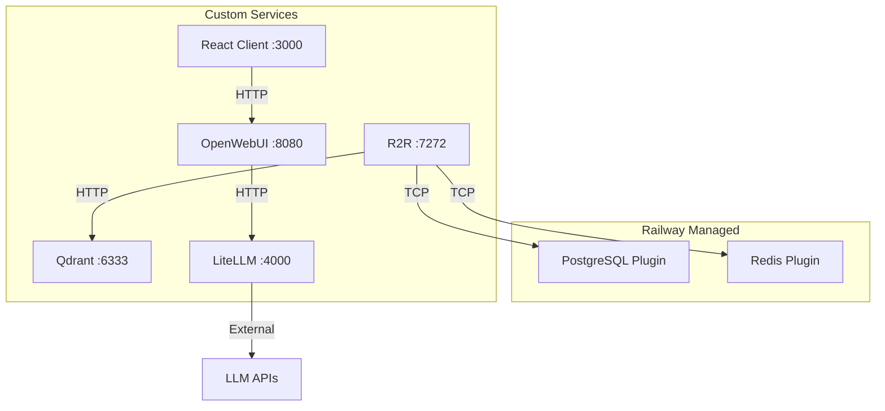
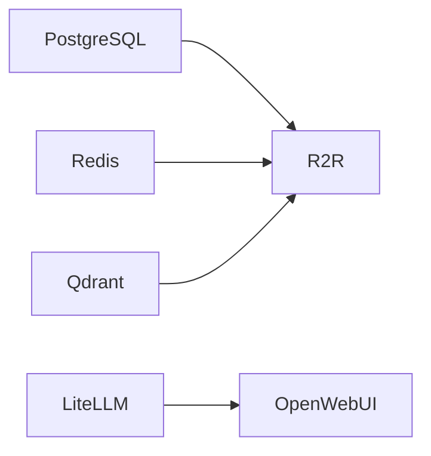

# Railway Template Architecture Design

## Directory Structure

```
llm-stack/
├── railway.json                    # Template manifest
├── README.md                       # Template documentation
├── services/
│   ├── react-client/
│   │   ├── Dockerfile
│   │   ├── railway.toml
│   │   └── src/
│   ├── r2r/
│   │   ├── Dockerfile
│   │   └── railway.toml
│   ├── qdrant/
│   │   ├── Dockerfile
│   │   └── railway.toml
│   ├── litellm/
│   │   ├── Dockerfile
│   │   ├── railway.toml
│   │   └── config.yaml
│   └── openwebui/
│       ├── Dockerfile
│       └── railway.toml
```

## Service Architecture



## Service Definitions

### Railway-Managed Plugins

| Service | Type | Internal Host | Variables Exposed |
|---------|------|---------------|-------------------|
| PostgreSQL | Plugin | `${{Postgres.PGHOST}}` | `DATABASE_URL`, `PGHOST`, `PGPORT`, `PGUSER`, `PGPASSWORD`, `PGDATABASE` |
| Redis | Plugin | `${{Redis.REDIS_URL}}` | `REDIS_URL`, `REDIS_HOST`, `REDIS_PORT`, `REDIS_PASSWORD` |

### Custom Docker Services

| Service | Port | Internal DNS | Health Check |
|---------|------|--------------|--------------|
| react-client | 3000 | `react-client.railway.internal` | HTTP `/` |
| r2r | 7272 | `r2r.railway.internal` | HTTP `/health` |
| qdrant | 6333 | `qdrant.railway.internal` | HTTP `/readyz` |
| litellm | 4000 | `litellm.railway.internal` | HTTP `/health` |
| openwebui | 8080 | `openwebui.railway.internal` | HTTP `/` |

## Environment Variables by Service

### react-client
```
PORT=3000
```

### r2r
```
R2R_PORT=7272
R2R_HOST=0.0.0.0
R2R_POSTGRES_HOST=${{Postgres.PGHOST}}
R2R_POSTGRES_PORT=${{Postgres.PGPORT}}
R2R_POSTGRES_USER=${{Postgres.PGUSER}}
R2R_POSTGRES_PASSWORD=${{Postgres.PGPASSWORD}}
R2R_POSTGRES_DBNAME=${{Postgres.PGDATABASE}}
R2R_VECTOR_DB_PROVIDER=qdrant
R2R_QDRANT_HOST=qdrant.railway.internal
R2R_QDRANT_PORT=6333
REDIS_URL=${{Redis.REDIS_URL}}
```

### qdrant
```
QDRANT__SERVICE__HTTP_PORT=6333
QDRANT__SERVICE__GRPC_PORT=6334
```

### litellm
```
LITELLM_PORT=4000
LITELLM_MASTER_KEY=${LITELLM_MASTER_KEY}
OPENAI_API_KEY=${OPENAI_API_KEY}
ANTHROPIC_API_KEY=${ANTHROPIC_API_KEY}
```

### openwebui
```
PORT=8080
OPENAI_API_BASE_URL=http://litellm.railway.internal:4000/v1
OPENAI_API_KEY=${LITELLM_MASTER_KEY}
WEBUI_AUTH=false
```

## Service Dependencies



**Startup Order:**
1. PostgreSQL, Redis, Qdrant (no dependencies)
2. LiteLLM (no internal dependencies)
3. R2R (depends on PostgreSQL, Redis, Qdrant)
4. OpenWebUI (depends on LiteLLM)
5. React Client (no dependencies)

## railway.json Template Manifest

The template manifest should define:
- All services with their source directories
- Plugin services for PostgreSQL and Redis
- Shared variables with `${{}}` syntax
- User-configurable variables marked appropriately

## Key Design Decisions

1. **PostgreSQL & Redis as Plugins**: Use Railway's managed services for reliability and automatic backups
2. **Qdrant Volume**: Needs persistent volume mount at `/qdrant/storage`
3. **LiteLLM Config**: Uses YAML config for model routing, mounted at `/app/config.yaml`
4. **OpenWebUI**: Connects to LiteLLM as OpenAI-compatible endpoint
5. **All services use `ON_FAILURE` restart policy**
6. **Health checks defined for all custom services**