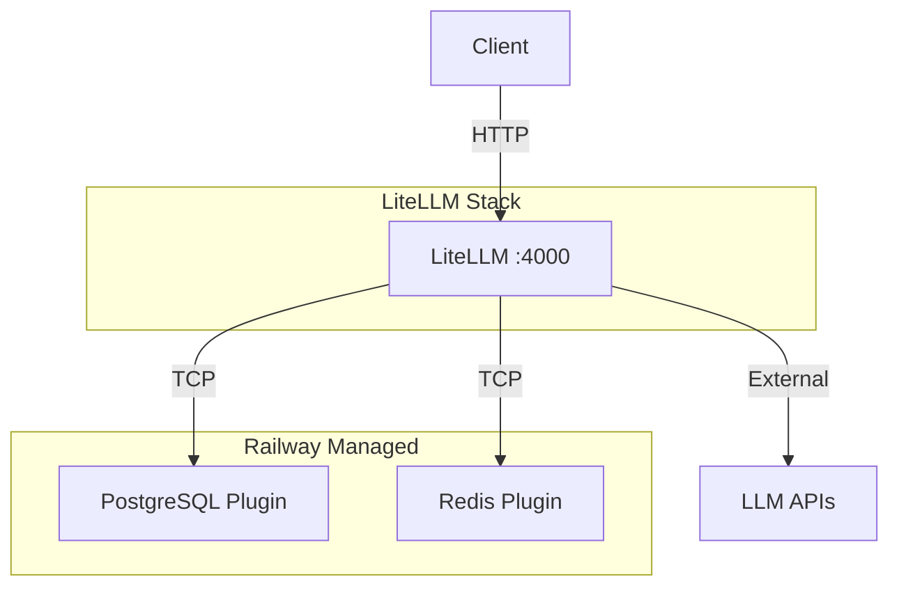
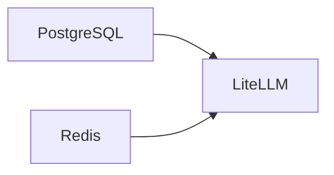

# Railway Template Architecture Design

## Directory Structure

```
llm-stack/
├── README.md                       # Template documentation
├── ENV_VARIABLES_GUIDE.md          # Environment variable reference
├── QUICK_START_RAILWAY.md          # Quick start guide
├── k8s/
│   ├── manifests.yaml              # All-in-one K8s manifest
│   └── base/                       # Individual K8s manifests
├── services/
│   ├── litellm/
│   │   ├── Dockerfile
│   │   ├── railway.toml
│   │   ├── config.yaml
│   │   └── README.md
│   └── postgres-pgvector/
│       ├── Dockerfile
│       ├── railway.toml
│       └── README.md
└── docs/                           # Documentation
```

## Service Architecture


```mermaid
graph TB
    subgraph Railway Managed
        PG[PostgreSQL Plugin]
        RD[Redis Plugin]
    end
    
    subgraph LiteLLM Stack
        LL[LiteLLM :4000]
    end
    
    LL -->|TCP| PG
    LL -->|TCP| RD
    LL -->|External| LLM[LLM APIs]
    
    Client -->|HTTP| LL
```

## Service Definitions

### Railway-Managed Plugins

| Service | Type | Internal Host | Variables Exposed |
|---------|------|---------------|-------------------|
| PostgreSQL | Plugin | `${{Postgres.PGHOST}}` | `DATABASE_URL`, `PGHOST`, `PGPORT`, `PGUSER`, `PGPASSWORD`, `PGDATABASE` |
| Redis | Plugin | `${{Redis.REDIS_URL}}` | `REDIS_URL`, `REDIS_HOST`, `REDIS_PORT`, `REDIS_PASSWORD` |

### Custom Docker Services

| Service | Port | Internal DNS | Health Check |
|---------|------|--------------|--------------|
| litellm | 4000 | `litellm.railway.internal` | HTTP `/health` |

## Environment Variables by Service

### litellm
```
LITELLM_PORT=4000
LITELLM_MASTER_KEY=${LITELLM_MASTER_KEY}
DATABASE_URL=${{Postgres.DATABASE_URL}}
REDIS_URL=${{Redis.REDIS_URL}}
OPENAI_API_KEY=${OPENAI_API_KEY}
ANTHROPIC_API_KEY=${ANTHROPIC_API_KEY}
```

## Service Dependencies


```mermaid
graph LR
    PG[PostgreSQL] --> LL[LiteLLM]
    RD[Redis] --> LL
```

**Startup Order:**
1. PostgreSQL, Redis (no dependencies)
2. LiteLLM (depends on PostgreSQL and Redis for caching)

## Key Design Decisions

1. **PostgreSQL & Redis as Plugins**: Use Railway's managed services for reliability and automatic backups
2. **LiteLLM Config**: Uses YAML config for model routing, mounted at `/app/config.yaml`
3. **All services use `ON_FAILURE` restart policy**
4. **Health checks defined for LiteLLM service**
5. **Simplified 3-service stack**: Focus on core LLM proxy functionality
